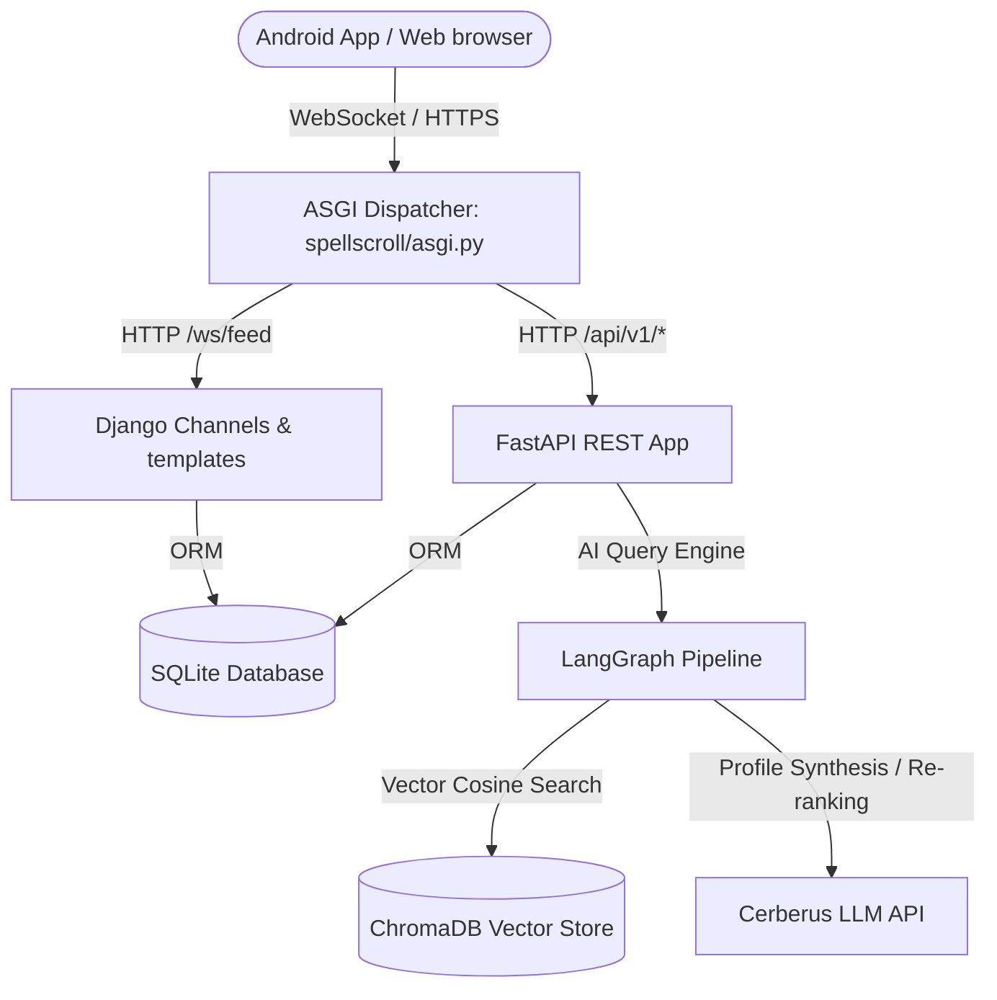
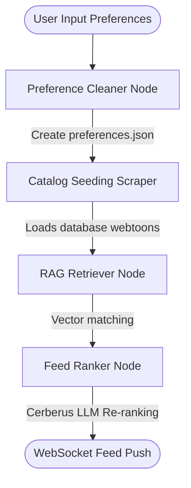

# SPELLSCROLL 📜 — AI Webtoon Discovery Platform

[](https://opensource.org/licenses/MIT)
[](https://www.djangoproject.com/)
[](https://fastapi.tiangolo.com/)
[](https://www.trychroma.com/)
[](https://cerberusai.io/)

**SpellScroll** is a highly personalized, AI-curated colorful webtoon discovery and tracking platform. Designed as a unified ASGI application, it mounts a **FastAPI** REST backend inside a **Django** web framework process. It leverages a stateful **LangGraph** multi-agent pipeline, **ChromaDB** local vector search, and a beautiful dark ambient ink-and-neon user interface.

---

## 📖 Table of Contents
1. [Core Features](#-core-features)
2. [Architecture Design](#-architecture-design)
3. [LangGraph Multi-Agent Sequence](#-langgraph-multi-agent-sequence)
4. [Database Architecture (Hybrid SQL + NoSQL)](#-database-architecture-hybrid-sql--nosql)
5. [Interactive Setup & Installation](#-interactive-setup--installation)
6. [Administration Console](#-administration-console)
7. [API Route Summary](#-api-route-summary)
8. [License](#-license)

---

## ✨ Core Features

*   **⚡ Unified ASGI Server**: Runs Django Channels (WebSockets) and FastAPI REST endpoints under a single async process.
*   **🤖 LangGraph Recommendation Agent**: Orchestrated multi-agent pipeline matching user tastes to a database of 300+ webtoons.
*   **🔎 Local Semantic Embedding**: Uses local HuggingFace `all-MiniLM-L6-v2` embeddings for fast similarity computations without API fees.
*   **🌀 Resilient Offline Fallback**: Works seamlessly even without external AI keys, using rules-based matching.
*   **📱 PWA & Android-First Layout**: Service Workers, app manifests, and viewport sizing for installation directly onto Android devices.

---

## 📐 Architecture Design



---

## 🤖 LangGraph Multi-Agent Sequence



*   **Preference Cleaner**: Formulates structured preferences JSON from natural language inputs.
*   **RAG Retriever**: Queries nearest matches in the ChromaDB vector space while excluding previously skipped webtoons.
*   **Feed Ranker**: Applies Cerberus LLM scoring to sort recommendations based on tone, art style, and thematic preferences.
*   **Feedback Updater**: Enhances `preferences.json` weights automatically when users complete or skip cards.

---

## 💾 Database Architecture (Hybrid SQL + NoSQL)

### Relational Schema (SQLite)
*   **`SpellUser`**: Extends Django's `AbstractUser` with specific profile parameters.
*   **`Webtoon`**: Catalog cache (titles, slugs, genres, synopses, and cover URLs).
*   **`UserWebtoonStatus`**: Captures user interactions (status: suggested/reading/completed/skipped, rating, notes).
*   **`FeedCycle`**: Holds history of recommendation cycles.

### Document Storage (`media/users/{id}/`)
*   `preferences.json`: Fine-tuned user profile metadata (genre list, tone list, disliked themes).
*   `cycle_state.json`: Resumable checkpoint storage for LangGraph thread states.

---

## 🚀 Interactive Setup & Installation

Configure and run SpellScroll on your server or PC:

<details>
<summary>📋 Step 1: Set Up Python Virtual Environment</summary>

```bash
git clone https://github.com/MdSadman20040812/SpellScroll.git
cd SpellScroll

python -m venv venv
# Windows
.\venv\Scripts\activate
# Linux/macOS
source venv/bin/activate
```
</details>

<details>
<summary>📦 Step 2: Install Required Modules</summary>

```bash
pip install -r requirements.txt
```
</details>

<details>
<summary>🔑 Step 3: Populate Environment Settings</summary>

Create a `.env` file at the root:
```ini
SECRET_KEY=django-secret-key-here
DEBUG=True
DATABASE_URL=sqlite:///db.sqlite3
CERBERUS_API_KEY=your_cerberus_key
MANGADEX_CLIENT_ID=your_mangadex_id
MANGADEX_CLIENT_SECRET=your_mangadex_secret
SERPAPI_KEY=your_serpapi_key
REDIS_URL=redis://localhost:6379/0
```
</details>

<details>
<summary>🗄️ Step 4: Run Migrations & Collect Static Assets</summary>

```bash
python manage.py migrate
python manage.py collectstatic --noinput
```
</details>

<details>
<summary>📡 Step 5: Start Redis & Celery Workers (Optional background scraping)</summary>

```bash
# Start Celery Worker
celery -A spellscroll worker --loglevel=info
```
</details>

<details>
<summary>⚡ Step 6: Launch Unified ASGI Server</summary>

```bash
python manage.py runserver
```
Open **`http://localhost:8000`** in your browser.
</details>

---

## 👑 Administration Console

The platform provides a secure override portal for system supervisors to audit state graphs.

*   **Admin Address**: `http://localhost:8000/admin-spell/login/`
*   **Default Username**: `spellmaster`
*   **Default Password**: `Scroll@Admin2025!`
*   *Capabilities*: Review raw `preferences.json` logs, view LangSmith run trace links, clear/rebuild local vector stores, and trigger catalog scraping jobs.

---

## 🧭 API Route Summary

All REST endpoints are served on `/api/v1/` and guarded with JWT authorizations:

| Method | Endpoint | Description |
| :--- | :--- | :--- |
| **POST** | `/auth/register` | Create user credentials. |
| **POST** | `/auth/login` | Return validation tokens. |
| **POST** | `/onboarding/preferences` | Submit taste preferences to initialize LangGraph. |
| **GET** | `/feed/current` | Retrieve the top 20 personalized recommendations. |
| **POST** | `/feed/feedback` | Register user interaction with a webtoon card. |

---

## 📄 License

Licensed under the MIT License. See [LICENSE](LICENSE) for details.
