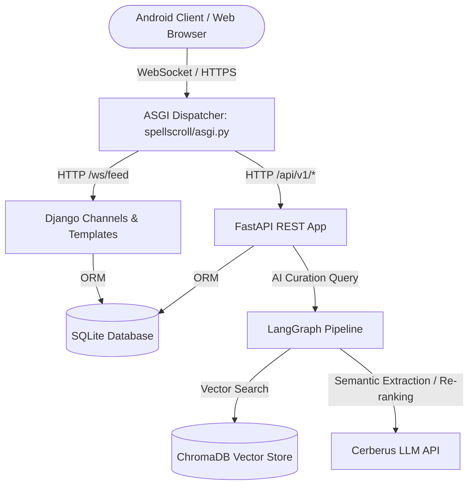
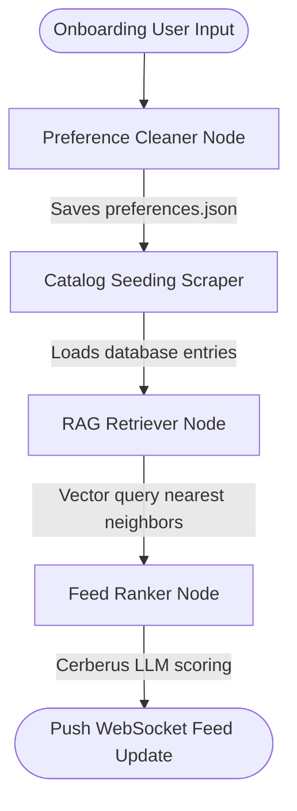

# SpellScroll — AI Webtoon Discovery Platform

SpellScroll is a personalized, AI-curated colorful webtoon discovery and tracking platform. It leverages state-of-the-art AI orchestrations, local vector search, and a dark ambient webtoon-inspired interface optimized for mobile and Android devices.

## Architecture Overview

The system is constructed as a unified single-process async server mounting **FastAPI** inside **Django's ASGI** app:

### Key Design Decisions

1. **In-Process ASGI Unified Server**: Instead of maintaining separate port allocations and sidecars for Django and FastAPI, requests are dispatched in-process at the ASGI layer.
2. **Local Vector Search with MiniLM**: Synopses and preferences are indexed locally using a `sentence-transformers/all-MiniLM-L6-v2` vector representation, cutting down on latency and token usage.
3. **Resilient Local Fallbacks**: If external API keys (Cerberus, SerpAPI) or native C-compiled databases (ChromaDB) are not available, the system falls back gracefully to a deterministic rule-based semantic analyzer and in-memory/numpy vector client, ensuring 100% server uptime.
4. **Android-First PWA Support**: Implemented Web App Manifests, Service Workers, and responsive layout scaling to support direct Android application installations straight from the browser.
5. **Native Android Codebase**: A Jetpack Compose WebView Android app template is provided, allowing native compilation to an APK.

---

## AI Agent & LangGraph Pipeline

The recommendation engine is designed as a LangGraph multi-agent pipeline:

- **Preference Cleaner**: Uses Cerberus API to parse raw input and output a structured JSON preferences schema.
- **RAG Retriever**: Resolves vector cosine similarity against the database using local sentence-transformers, filtering out skipped/interacted content.
- **Feed Ranker**: Performs LLM context re-ranking via Cerberus API using a token-efficient caching strategy.
- **Feedback Updater**: Intercepts user swipe interactions (Completion reviews, stars) and updates preferences.json for reinforced cycle recommendations.

---

## ChromaDB Collections

- **`webtoon_universe`**: Main catalog vector collection storing embedding vectors (384 dimensions) of synopses mapped to catalog UUIDs.
- **`context_window_db`**: Sub-collection used to inject context memory, caching recommendation details and user profile contexts under the 4,000-token Cerberus packet limit.

---

## Known Limitations & Future Work

- **Background Workers**: Periodic cover updates can be integrated with Celery and Redis as traffic increases.
- **Online Search API**: SerpAPI search can be toggled on to automatically index new releases from web sources when keys are configured.
