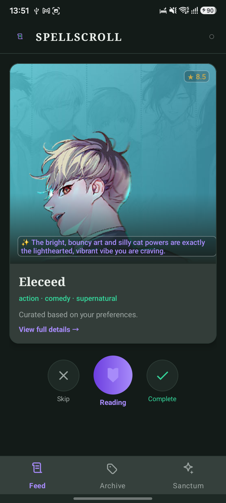
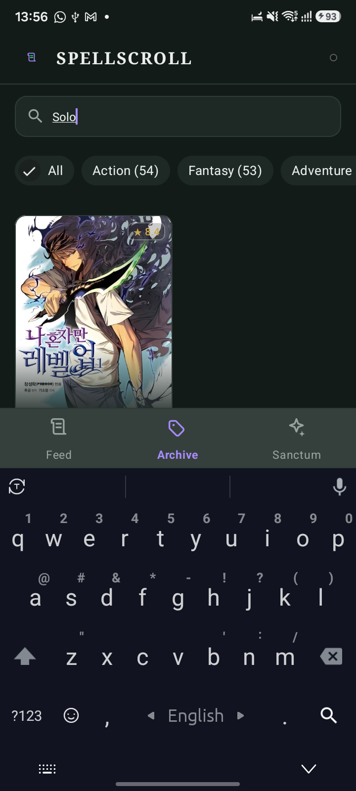
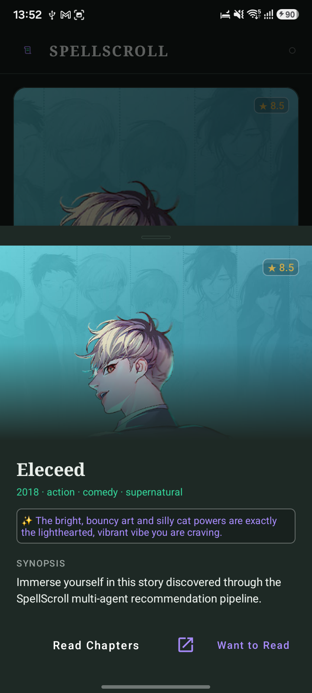
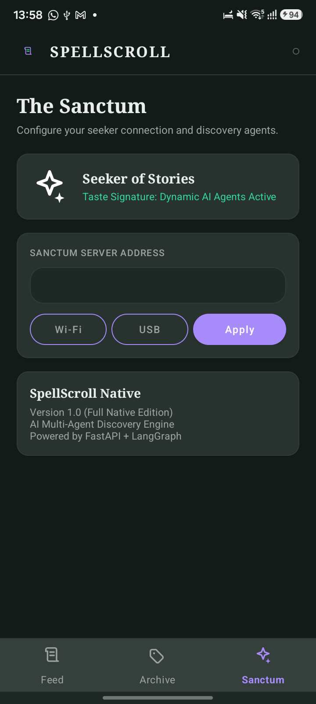
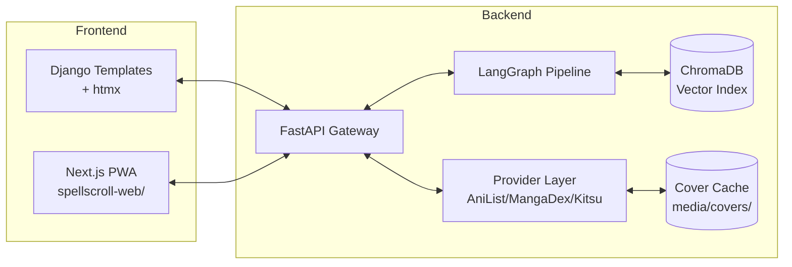

**Taste-driven reading feed for webtoons. Describe what you like; get a curated feed.**

---

## 🖼️ Preview


*Personalized feed — taste-ranked cards with dominant-color accents.*


*Semantic search — plain-language queries find relevant series.*


*Detail view — synopsis, tags, and recommendations.*


*Sanctum library — your reading history, organized.*

---

## 🏗️ Architecture


```mermaid
graph LR
    subgraph Frontend
        Web[Django Templates<br/>+ htmx]
        PWA[Next.js PWA<br/>spellscroll-web/]
    end
    subgraph Backend
        API[FastAPI Gateway]
        AGENTS[LangGraph Pipeline]
        PROV[Provider Layer<br/>AniList/MangaDex/Kitsu]
        VDB[(ChromaDB<br/>Vector Index)]
        CACHE[(Cover Cache<br/>media/covers/)]
    end
    Web <--> API
    PWA <--> API
    API <--> AGENTS
    API <--> PROV
    AGENTS <--> VDB
    PROV <--> CACHE
```

---

## ✨ Features

- **Taste signature** — LangGraph agent builds your preference vector from natural language
- **Reactive feed** — re-ranks on every like/skip/bookmark
- **Provider coverage** — 63-title test suite with 100% resolution
- **Cover resilience** — local mirror → fresh download → generated placeholder
- **Offline-first PWA** — installable web app with cached catalog

---

## 🚀 Quick Start

```bash
python -m venv venv && source venv/bin/activate  # or venv\Scripts\activate on Windows
pip install -r requirements.txt
python manage.py migrate
python manage.py sync_catalog --limit 80
python -m uvicorn spellscroll.asgi:application --port 8000
```

Open <http://localhost:8000>. **No API keys required.**

---

## 📁 Project Structure

```
SpellScroll/
├── agents/                    # LangGraph taste pipeline
│   ├── pipeline.py            # Main agent orchestration
│   ├── taste_signature.py     # Preference vector builder
│   └── ranker.py              # Feed ranking logic
├── api/                       # FastAPI routes
├── apps/                      # Django apps
├── services/                  # Provider integrations + cover cache
│   ├── providers.py           # AniList / MangaDex / Kitsu
│   └── cover_service.py       # Multi-tier cover resolution
├── static/css/                # Design system tokens
├── spellscroll-web/           # Next.js PWA frontend
├── android/                   # Android WebView shell
├── templates/                 # Django templates
├── tests/
│   └── test_provider_coverage.py  # 63-title resolution test
├── requirements.txt
├── BACKEND_SETUP.md
└── README.md
```

---

## 📄 License

MIT © Md Sadman Bin Masud
