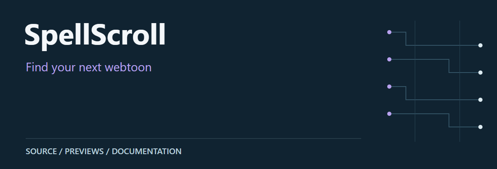
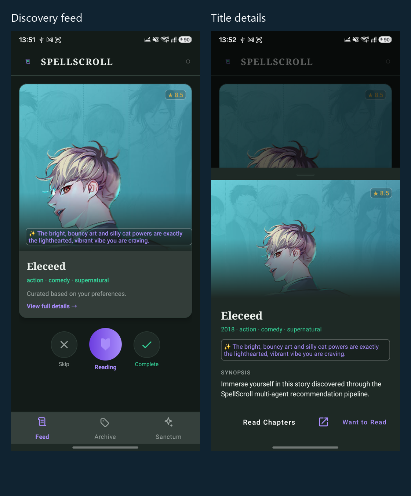
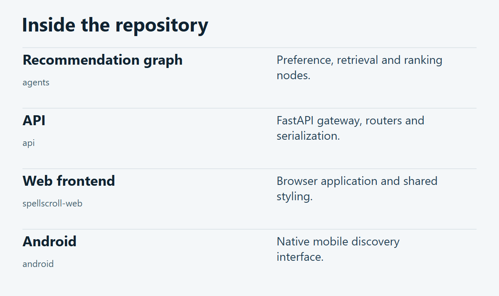

# SpellScroll

A webtoon-discovery project with Django and FastAPI services, a LangGraph recommendation pipeline, a web frontend and an Android client.

**[Source guide](#source-guide)** · **[Getting started](#getting-started)** · **[Scope & limitations](#scope--limitations)**

## Preview

[](docs/visuals/phone-preview.png)

Existing Android captures: discovery feed and title detail. Tap the image to enlarge.

## Source guide

[](docs/visuals/repository-guide.png)

| Component | Open source | Purpose |
| :-- | :-- | :-- |
| Recommendation graph | [`agents`](agents) | Preference, retrieval and ranking nodes. |
| API | [`api`](api) | FastAPI gateway, routers and serialization. |
| Web frontend | [`spellscroll-web`](spellscroll-web) | Browser application and shared styling. |
| Android | [`android`](android) | Native mobile discovery interface. |

## Getting started

From a local checkout of this repository:

```bash
python -m pip install -r requirements.txt
python manage.py migrate
python -m uvicorn spellscroll.asgi:application --host 127.0.0.1 --port 8000
```

## Scope & limitations

Configure the environment and catalog following [backend setup](BACKEND_SETUP.md) before use. Screenshots are existing repository captures. Cover artwork belongs to its respective rights holders.

---

[Visual asset sources and presentation notes](docs/visuals/README.md)
